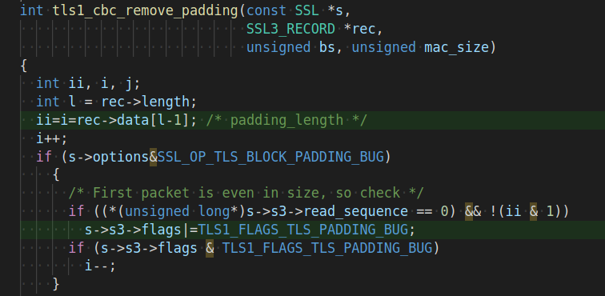

# Constantine
This is the future home of `Constantine`: a compiler-based system to automatically harden programs against microarchitectural side channels.

`Constantine` pursues a radical design point where secret dependent control and data flows are completely linearized: all the possible secret-dependent code/data memory accesses are always executed regardless of the particular secret value encountered.
Thanks to carefully designed optimizations such as *just-in-time loop linearization* and *aggressive function cloning*, `Constantine` provides a scalable solution, while supporting all the common programming constructs in real-world software. 

This is the high-level architecture of `Constantine`:

<br/><br/>

<br/><br/>

`Constantine` outperforms prior comprehensive solutions in terms of both performance and compatibility, while also providing stronger security guarantees. For example, we show `Constantine` yields overheads as low as 16% for cache-line attacks on standard benchmarks. Moreover, `Constantine` can protect ECDSA signatures in the [wolfSSL](https://www.wolfssl.com/) embedded library to complete a constant-time modular multiplication in 8 ms.

The design behind `Constantine` is described in the paper *Constantine: Automatic Side-Channel Resistance Using Efficient Control and Data Flow Linearization* (preprint available [here](http://www.diag.uniroma1.it/~delia/papers/ccs21.pdf) or on [arXiv](https://arxiv.org/abs/2104.10749)) which will appear in the [ACM CCS 2021](https://www.sigsac.org/ccs/CCS2021/) conference. 

## Getting Started

Constantine is based on LLVM 9. Compile and install all the LLVM passes:

```bash
./install.sh
. ./setup.sh
./llvm_compile_dfsan_cpp.sh
(cd passes && make install)
(cd lib && make install)
(cd utils/pintool && make check-profiler)
```

## Benchmarks
To run the benchmarks:
```bash
cd ./apps/$BENCH
./run_all
```
This will produce a result.csv file with all the measurements.

## Using Constantine

We provide a compiler wrapper to linearize arbitrary source file.

It will automatically:
1. produce a bitcode file.
2. build it with a dfsan profiler for dynamic taint analysis.
3. run a random-input test suite over the profiler that executes the various paths of the program to gather taint and loops information.
4. automatically protect all the branches, loops and memory accesses that the profiling phase identified as secret dependent.
5. produce a hardened binary.

**NOTICE1**: Constantine protects only the branches, memory accesses and loops that observes being secret sensitive during the random-input profiling phase. A simple random testing is usually enough for cryptographic algorithms, but beware that if a branch/memory-access is not explored it will not be protected, even if potentially secret sensitive. Provide an actual test suite to constantine in case random testing is not effective in exploring program states. 

**NOTICE2**: All inputs are considered secret sensitive by default. Constantine observes input flowing trough explicit `read`, `pread` and `fread`. Add hooks in `./src/lib/dft/hook.c` in case this is not enough.


Use `./constantine` for C sources and `./constantine++` for C++.

### example output:
```
$ ./constantine -O1 apps/issta2018-benchmarks-wu/examples/chronos/aes.c -o aes.out
[+] building taint profiler
    [ ... statistics ...]
[+] running taint profiler
[+] processing taint information
[+] building loop profiler
    [ ... more statistics ...]
[+] running loop profiler
[+] building constant time version
    [ ... more and more statistics ...]
```

## passes

The folder contains all the custom passes needed by Constantine. A brief non-complete list here:
- CGC: clone all the functions in the module to make them unique
- branch-extract: extract all the selected branched in new functions, to deal with them separatedly
- CFL: linearize control flow, assumes structurized CFG, and that each function has a single, normalized, branch
- coverage-id: assign unique ID to each instruction in the module to identify them between passes
- DFL: linearize data flow
- fix-[...]: different passes to fix bugs of llvm CFG structurization pass
- hook: insert dfsan wrappers and div hooks
- ICP: indirect call promotion
- loops-CFL: linearize loops, assumes structurized CFG and that each function as a single normal loop
- mark-induction-variables: find and mark loop induction variables for DFL optimizations
- remove-[...]: different passes to transform CFG to remove unwanted graph structures
- set-norecurse-ext: set and forward norecurse attribute along the callgraph dealing with external calls
- stack-vars-promotion: promote all the stack variables in non-recursive functions to globals, to optimize DFL usage
- taintglb: taint global variables based on regexes


## lib

The folder contains all the libraries that our passes rely on:
- cfl: all the CFL helpers needed by the CFL pass. The pass assumes this has been linked with the code it analyzes
- dfl: all the DFL helpers needed by the DFL pass. The pass assumes this has been linked with the code it analyzes
- cgc: CGC helpers used when indirect calls are not promoted with ICP
- dft: dfsan wrappers to taint inputs and log taints. Supported input functions are: read, fread, pread
- utils: various wrappers to deal with memset/memcpy functions

## vscode-extension

We provide in addition a vscode extension to visualize tainted instructions in the source code
Install it running `code --install-extension ./tainthighlight-0.0.1.vsix`.

It will parse the taint files generated by constantine. To activate it in vscode press `CTRL + shift + P` and execute `Highlight Tainted`.
To manually force the parsing of a taint file execute `Parse Taint File `.




## Cite
```
@inproceedings{constantine,
    author = {Borrello, Pietro and D'Elia, Daniele Cono and Querzoni, Leonardo and Giuffrida, Cristiano},
    title = {Constantine: Automatic Side-Channel Resistance Using Efficient Control and Data Flow Linearization},
    year = {2021},
    publisher = {Association for Computing Machinery},
    booktitle = {Proceedings of the 2021 ACM SIGSAC Conference on Computer and Communications Security},
    location = {Seoul, South Korea},
    series = {CCS '21},
    doi={10.1145/3460120.3484583},
}
```
